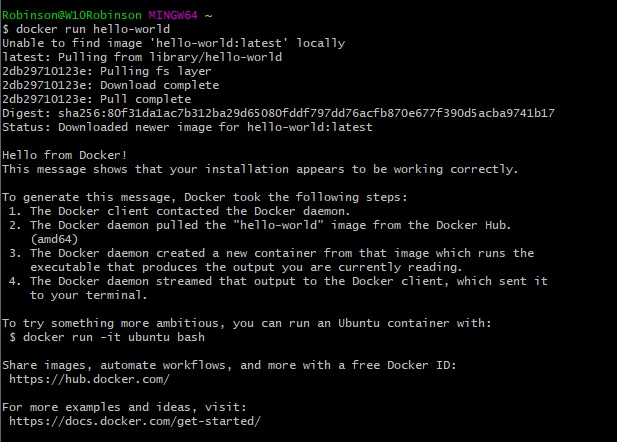
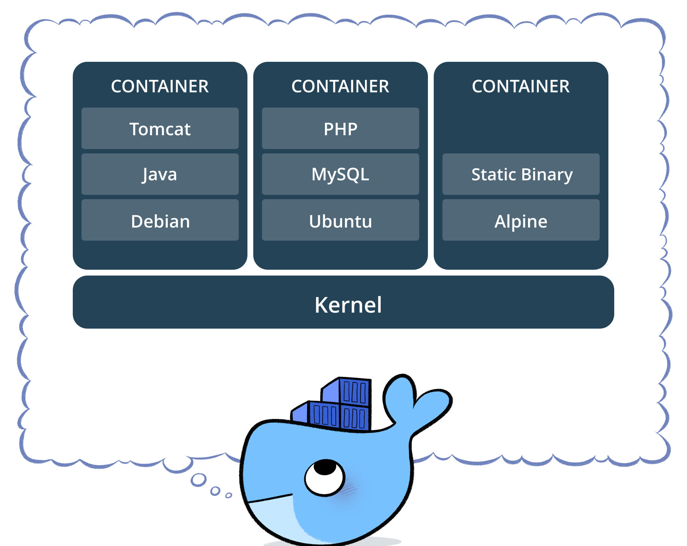
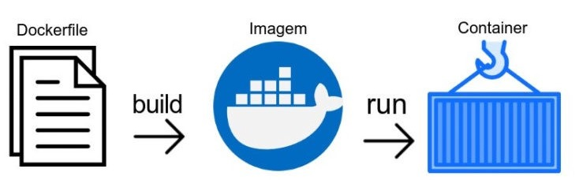
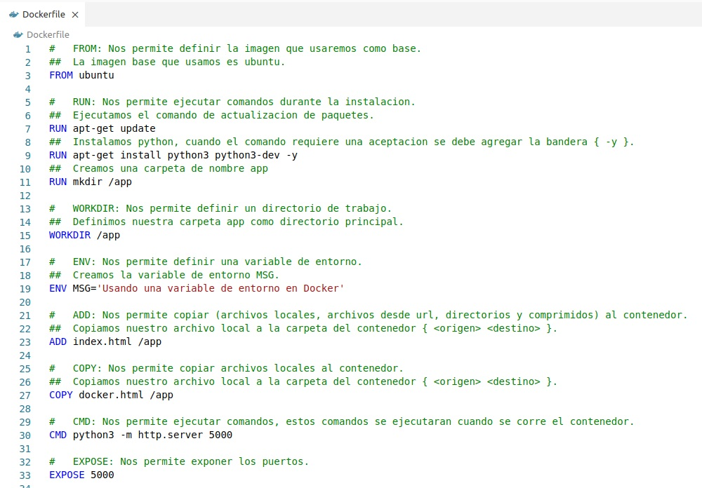
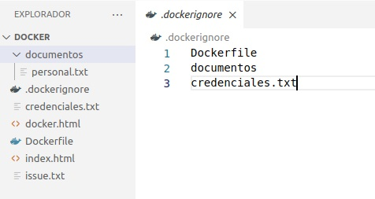
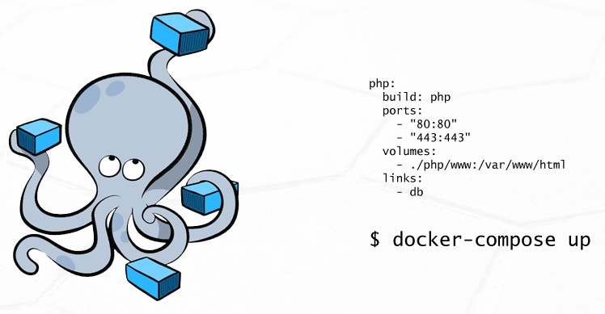
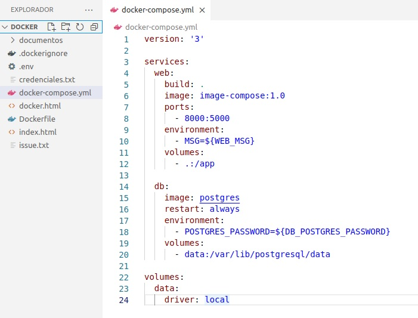

<div align="center">
  <a href="https://www.docker.com/">
    
  </a>

  [](https://docker.com)

  <p align="center">
    En este README encontrara la información necesaria para comprender Docker!
  </p>
</div>
</br>

## I. INTRODUCCIÓN

#### ¿Qué es Docker?

Proyecto de código abierto que automatiza el despliegue de aplicaciones dentro de contenedores de software mediante una imagen, sus contenedores permiten correr aplicaciones, en cualquier lugar, sin complicaciones y eliminando el clásico: **“En mi computadora si funciona”**.

### 1. Arquitectura
  #### 1.1 Docker Engine (Conocido como el motor de docker)
  <div align="center">
    
  </div>

  #### 1.2 Arquitectura Docker
  <div align="center">
    
  </div>

### [2. Instalación Docker Desktop](https://docs.docker.com/get-docker/)

### 3. Hola Mundo en Docker
Para este ejemplo levantaremos un contenedor usando la imagen hello-world de docker hub.

```bash
docker run hello-world
```

<div align="center">
  
</div>


## II. CONTENEDORES

Un contenedor es una unidad estándar de software que empaqueta el código y todas sus dependencias para que la aplicación se ejecute de forma rápida y confiable de un entorno informático a otro.

<div align="center">
  
</div>

  ### 1. Comandos más usados

  | COMANDO | DOCKER COMANDO | DESCRIPCION |
  | --- | --- | --- |
  | **ps** | ```docker ps``` | Listar contenedores en ejecución { ps } |
  | **ps -a** | ```docker ps -a``` | Listar todos los contenedores { ps -a } |
  | **run** | ```docker run nginx``` | Ejecutamos un contenedor { run } |
  | **run -d** | ```docker run -d ngin``` | Ejecución de un contenedor en Modo Separado (detached) { run -d } |
  | **--name** | ```docker run -d --name mi-nginx nginx``` | Asignar un nombre a nuestro contenedor { --name [nombre] } |
  | **exec** | ```docker exec mi-nginx ls``` | Ejecutar comandos { exec [ID o Nombre] [comando] } |
  | **exe -it** | ```docker exec -it mi-nginx bash``` | Ejecutar comandos de forma interactiva { exec -it [ID o Nombre] [comando] } |
  | **stop** | ```docker stop mi-nginx``` | Detener un contenedor { stop [ID o Nombre] } |
  | **start** | ```docker start mi-nginx``` | Iniciar un contenedor { start [ID o Nombre] } |
  | **rm** | ```docker rm mi-nginx``` | Eliminar un contenedor { rm [ID o Nombre] } |
  | **--rm** | ```docker run -d --rm --name mi-nginx nginx``` | Podemos usar el comando { --rm } junto con el de ejecución de esta manera el contenedor se eliminara cuando este se detenga o de error |
  | **-p** | ```docker run -d --rm -p 8000:80 --name mi-nginx nginx``` | Asignar un puerto a nuestro contenedor { -p [puerto-local]:[puerto-contenedor] } |
  | **logs** | ```docker logs mi-nginx``` | Visualizar los logs de un contenedor { logs [ID o Nombre] } |
  | **top** | ```docker top mi-nginx``` | Saber los procesos en ejecución { top [ID o Nombre] } |


  >  **_Tip_: La forma recomendada de ejecutar un contenedor es el modo detached.**


  ### 2. Volúmenes
  
  Tomando como base los comandos: ```run -d --rm -p --name```
  
  Los volúmenes son el mecanismo preferido para conservar los datos generados y utilizados por los contenedores de Docker.

  <div align="center">
    
  </div>

  > **_Nota_: Si utiliza bash debe utilizar el comando /$(pwd) para hacer referencia a la ubicación actual.**

  #### Comandos

  | COMANDO | DOCKER COMANDO | DESCRIPCION |
  | --- | --- | --- |
  | **-v** | ```docker run -d --rm -p 4040:80 -v ~/Desktop/Docker:/usr/share/nginx/html --name my-nginx-v nginx``` | Usamos el volumen montaje de enlace o **"bind mount"** { -v [ruta-local]:[ruta-contenedor] } |
  | **volume ls** | ```docker volume ls``` | Listar Volumenes { volume ls } |
  | **volume create** | ```docker volume create ngivolume``` | Crear un Volumen { volume create [nombre] } |
  | **volume rm** | ```docker volume rm ngivolume``` | Eliminar un Volumen { volume rm [nombre] } |
  | **--mount** | ```docker run -d --rm -p 5050:80 --mount source=ngivolume,target=/usr/share/nginx/html --name my-nginx-mount nginx``` | Comando --mount en la creación del Contenedor, usando el volumen de montaje { source=[nombre-volumen],target=[ruta-contenedor] } |

  > **_Nota_: Para usar el comando --mount primero debemos crear un volumen.**


  ### 3. Redes

  Tomando como base los comandos: ```run -d --rm -p --name```

  El subsistema de red de Docker se puede conectar mediante controladores. Existen varios controladores de forma predeterminada y proporcionan la funcionalidad de red principal:

  * **Bridge (Default):** Asigna una dirección IP a los contenedores.
  * **Host:** No asigna dirección IP a los contenedores, mantiene comunicación con el Host.
  * **Overlay:** Permite comunicar 2 servidores que tienen Docker mediante el daemon.
  * **Macvlan:** Brinda una dirección física de red a nuestro contenedor.
  * **None:** Omite el uso de redes en tu contenedor.

  > **_Nota_: Para usar el comando --net primero debemos crear una red.**

  | COMANDO | DOCKER COMANDO | DESCRIPCION |
  | --- | --- | --- |
  | **network ls** | ```docker network ls``` | Listar Redes { network ls } |
  | **network inspect** | ```docker network inspect bridge``` | Inspeccionar una Red { network inspect [nombre-red] } |
  | **network create** | ```docker network create mi-red``` | Crear una red { network create [nueva-red] } |
  | **network rm** | ```docker network rm mi-red``` | Eliminar una red { network rm [nombre-red] } |
  | **network connect** | ```docker network connect bridge my-nginx-1``` | Conectar un contenedor a una red { network connect [nombre-red] [contenedor] } |
  | **--net** | ```docker run -d --rm -p 8000:80 --net=mi-red --name my-nginx-1 nginx``` | Crear un contenedor en una red especifica { --net=[nombre-red] } |


## III. IMÁGENES

Las imágenes de Docker son la base de los contenedores.

Una imagen es una colección ordenada de cambios en el sistema de archivo raíz y los parámetros de ejecución correspondientes para su uso dentro de un tiempo de ejecución de contenedor.

<div align="center">
  
</div>

Una imagen normalmente contiene una unión de sistemas de archivos en capas apilados uno encima de otro. Una imagen no tiene estado y nunca cambia.

<div align="center">
  
</div>

  ### 1. Comandos

  | COMANDO | DOCKER COMANDO | DESCRIPCION |
  | --- | --- | --- |
  | **image** | ```docker image ls``` | Listar las imágenes { image ls } |
  | **pull** | ```docker pull nginx``` | Descargar una imagen { pull [image:tags] } |
  | **tag** | ```docker tag hola-docker robinsonjra/hola-docker``` | Etiquetar una imagen { tag [current_tag] [new_tag] } |

  ### 2. Docker Hub
  
  Docker Hub es un recurso centralizado para trabajar con Docker y sus componentes. Proporciona los siguientes servicios:

  * Alojamiento de imágenes de Docker.
  * Autenticación de usuario.
  * Construcciones de imágenes automatizadas y herramientas de flujo de trabajo, como activadores de compilación y enlaces web.
  * Integración con GitHub y Bitbucket.


  #### [Pasos para subir una imagen](https://docs.docker.com/desktop/get-started/#credentials-management)

  * Iniciar Sesión en Docker Hub.
  * Crear un Repositorio (Nombre, Descripción y Visibilidad) en Docker Hub.
    * Nombre: robinsonjra/hola-docker
  * Agregamos una etiqueta con el mismo nombre del repositorio.
    * ```docker tag hola-docker:1.0 robinsonjra/hola-docker:1.0```
  * Iniciamos sesión desde la consola de docker
    * ```docker login```
    * Username: username-dockerhub
    * Password: password-dockerhub
  * Ejecutamos la consulta para la publicación.
    * ```docker push robinsonjra/hola-docker:1.0```

  ### 3. Dockerfile
  
  Un Dockerfile es un documento de texto que contiene todos los comandos que se ejecutarían manualmente para crear una imagen de Docker.

  Docker puede crear imágenes automáticamente leyendo las instrucciones de un Dockerfile.

  #### Nuestro primer Dockerfile

  * Crear un documento con el nombre Dockerfile.
  * Para colocar un comentario debe anteponer el caracter #.
  
  ```dockerfile
  #   FROM: Nos permite definir la imagen que usaremos como base.<br>
  ##  La imagen base que usamos es ubuntu.<br>
  FROM ubuntu <br>
  <br>
  #   RUN: Nos permite ejecutar comandos durante la instalacion.<br>
  ##  Ejecutamos el comando de actualizacion de paquetes.<br>
  RUN apt-get update<br>
  ##  Instalamos python, cuando el comando requiere una aceptacion se debe agregar la bandera { -y }.<br>
  RUN apt-get install python3 python3-dev -y<br>
  ##  Creamos una carpeta de nombre app<br>
  RUN mkdir /app<br>
  <br>
  #   WORKDIR: Nos permite definir un directorio de trabajo.<br>
  ##  Definimos nuestra carpeta app como directorio principal.<br>
  WORKDIR /app<br>
  <br>
  #   ENV: Nos permite definir una variable de entorno.<br>
  ##  Creamos la variable de entorno MSG.<br>
  ENV MSG='Usando una variable de entorno en Docker'<br>
  <br>
  #   ADD: Nos permite copiar (archivos locales, archivos desde url, directorios y comprimidos) al contenedor.<br>
  ##  Copiamos nuestro archivo local a la carpeta del contenedor { [origen] [destino] }.<br>
  ADD index.html /app<br>
  <br>
  #   COPY: Nos permite copiar archivos locales al contenedor.<br>
  ##  Copiamos nuestro archivo local a la carpeta del contenedor { [origen] [destino] }.<br>
  COPY docker.html /app<br>
  <br>
  #   CMD: Nos permite ejecutar comandos, estos comandos se ejecutaran cuando se corre el contenedor.<br>
  CMD python3 -m http.server 5000<br>
  <br>
  #   EXPOSE: Nos permite exponer los puertos.<br>
  EXPOSE 5000<br>
  ```

  <div align="center">
    
  </div>

  | COMANDO | DOCKER COMANDO | DESCRIPCION |
  | --- | --- | --- |
  | **build** | ```docker build -t hola-docker:1.0 ~/Desktop/Docker``` | Con build ejecutamos el Dockerfile el cual creara la nueva imagen, con -t definimos el nombre:versión { build -t [imagen:version] [src-dockerfile] } |
  | **run** | ```docker run -d --rm -p 8000:5000 --name my-hola-docker hola-docker:1.0``` | Ejecutamos nuestra imagen generada |
  | **-e** | ```docker run -d --rm -p 8000:5000 -e MSG='Nuevo Valor' --name my-docker hola-docker:v1.0``` | Con -e podemos ingresar un nuevo valor a nuestras variables de entorno definidas en el Dockerfile { -e [variable]=[valor] } |

  ### 4. Dockerignore
  
  Un Dockerignore es un documento de texto que nos permite listar el nombre de directorios y archivos que deseamos ignorar.

  Para usarlo se debe crear un archivo de nombre **".dockerignore"**, dentro de este archivo debemos escribir el nombre del directorio y/o archivo que deseamos ignorar.

  <div align="center">
    
  </div>


## IV. DOCKER COMPOSE

Docker Compose es una herramienta para definir y ejecutar aplicaciones Docker de varios contenedores.

Se usa un archivo **YAML** para configurar los servicios de su aplicación. Luego, con un solo comando, crea e inicia todos los servicios desde su configuración.

<div align="center">
  
</div>

  ### ¿Cómo funciona?
  
  Usar Docker Compose es básicamente un proceso de tres pasos:

  * Defina el entorno de su aplicación con un **Dockerfile** para que pueda reproducirse en cualquier lugar.
  * Defina los servicios que componen su aplicación en **docker-compose.yml** para que puedan ejecutarse juntos en un entorno aislado.
  * Ejecute **docker-compose up** para iniciar y ejecutar toda su aplicación.

  ### [Instalación](https://docs.docker.com/compose/install/)

  ### YAML & Comandos

  <div align="center">
    
  </div>

  A continuación listamos los comandos esenciales para el uso de docker-compose.

  | DOCKER COMANDO | DESCRIPCION |
  | --- | --- |
  | ```docker-compose version``` | Para saber la versión de nuestro docker-compose { version } |
  | ```docker-compose up -d``` | Ejecución de un docker-compose en Modo Separado (detached) { up -d } |
  | ```docker-compose -p="group-name" up -d``` | Colocar un nombre al agrupador creado por docker-compose { -p="group" up -d } |
  | ```docker-compose up -d --build``` | Ejecución de un docker-compose en Modo Separado (detached) y con cambios en el Dockerfile { up -d --build } |
  | ```docker-compose down``` | Detener la ejecución de nuestro docker-compose { down } |
  | ```docker-compose run web bash``` | Ejecutar comandos dentro de un servicio { run [services] [comando] } |